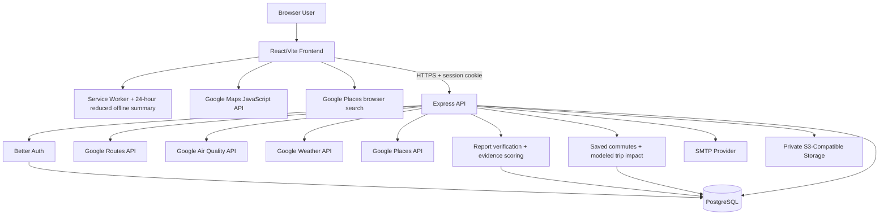
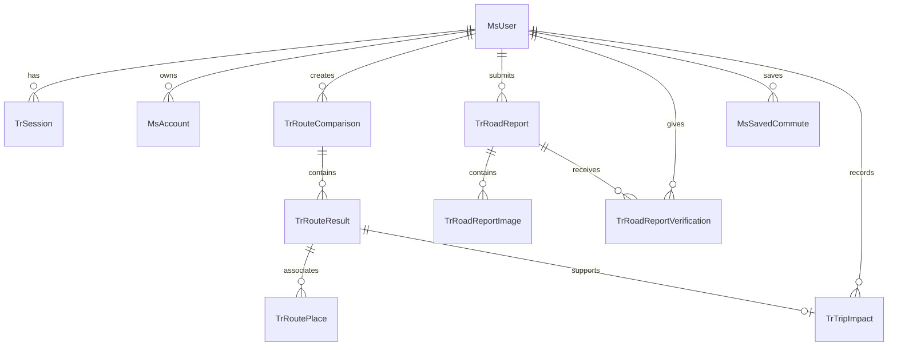

<div align="center">
  

  # AERoute
  ### A clearer route for every breath.

  [](https://aeroute.my.id)
  [](https://github.com/AERoutee/AERoute-FE)
  [](https://github.com/AERoutee/AERoute-BE)
  [](https://github.com/AERoutee/AERoute-FE/blob/main/LICENSE)

  **Submission for ITECHNO CUP 2026 - Web Development**

  **By AERoute Team**
</div>

---

## 📋 Daftar Isi

- [Tim Developer](#-tim-developer)
- [Tentang Proyek](#-tentang-proyek)
- [Fitur Unggulan](#-fitur-unggulan)
- [Demo & Screenshot](#-demo--screenshot)
- [Teknologi](#-teknologi)
- [Arsitektur Sistem](#-arsitektur-sistem)
- [Instalasi & Setup](#-instalasi--setup)
- [Penggunaan](#-penggunaan)
- [API Documentation](#-api-documentation)
- [Testing](#-testing)
- [Lisensi](#-lisensi)

---

## 👥 Tim Developer

| Nama | Peran | GitHub |
| --- | --- | --- |
| **Andrian Pratama** | Project Lead & Lead Full-Stack Developer | [@Yanzz231](https://github.com/Yanzz231) |
| **Jeremy Auriel Zhang** | Full-Stack Developer | [@jeremzhg](https://github.com/jeremzhg) |
| **Calvin Wu** | Product Manager | [@5calvinw](https://github.com/5calvinw) |

---

## 🎯 Tentang Proyek

### Latar Belakang

Aplikasi navigasi umumnya mengoptimalkan waktu dan jarak, sementara keputusan perjalanan juga dipengaruhi kualitas udara, cuaca, usaha berjalan, aksesibilitas yang diketahui, dan gangguan yang dilaporkan komunitas. Informasi tersebut sering tersebar dan sulit dibandingkan dalam satu alur.

AERoute mendukung **SDG 11 — Kota dan Komunitas Berkelanjutan** melalui perencanaan perjalanan aktif dan transit yang menjelaskan trade-off rute tanpa menjanjikan keselamatan.

### Solusi yang Ditawarkan

AERoute menyediakan lima pilihan langsung: **Walk, Cycle, Bus, Train, dan Subway**. Satu sampai maksimal tiga mode dapat dipilih sebagai preferensi atau kandidat yang diizinkan; hanya kombinasi yang tersedia yang ditampilkan. **Walk + Cycle** tanpa transit membandingkan dua alternatif aktif terpisah melalui request atomik Walk dan Cycle. Pilihan yang memuat **Cycle + transit** menjalankan dua kandidat berurutan secara bersamaan: itinerary komposit Cycle → transit → Walk dan fallback transit native dengan walking access, egress, serta transfers. Parkir sepeda pada titik transit pertama tidak diverifikasi. Alternatif aktif memakai prioritas **Balanced** atau **Lower exposure**; itinerary transit memakai **Less walking** atau **Fewer transfers**.

Perbandingan menggunakan durasi, jarak, modeled PM2.5 exposure index, evidence completeness, cuaca, dan sinyal laporan komunitas:

```text
estimated exposure index = average route PM2.5 × travel time in minutes
```

PM2.5 ditampilkan untuk kondisi saat ini serta bucket prakiraan per jam pada keberangkatan **+30** dan **+60 menit**. Segmen rute mengikuti progress sepanjang polyline dengan legenda hijau ≤15, kuning 15–35, merah >35, dan abu-abu untuk data tidak tersedia; cakupan parsial ditandai tanpa mengekstrapolasi seluruh rute. Jendela mendatang adalah perkiraan karena menggunakan resolusi hourly bucket. Exposure index dan modeled trip impact bukan personal dose, diagnosis, pengukuran inhalasi aktual, atau pengganti advis medis.

### Batasan Penting

- Hazard-aware ranking memakai sinyal community report, konfirmasi, dispute, kedekatan, dan kelengkapan bukti; hasil tidak berarti aman atau bebas hazard.
- Confidence yang ditampilkan adalah **evidence completeness**, bukan probabilitas keselamatan atau akurasi.
- Reduced-exertion adalah pendekatan berbasis data rute yang tersedia, bukan jaminan wheelchair-safe atau step-free; barrier, kemiringan, lift, dan akses penuh tidak diverifikasi.
- Break recommendation selalu ditampilkan untuk rute terpilih; kandidat Walk normal muncul otomatis karena semua layer default aktif. Popup rest/transit memakai galeri maksimal tiga foto, lightbox beratribusi, facility facts, serta tombol **View 360°** hanya setelah Street View tersedia dalam radius 50 m; data yang hilang tetap unknown dan tidak memverifikasi aksesibilitas penuh atau keselamatan.
- Route guidance memerlukan fix browser geolocation berakurasi 0–100 m, berumur maksimal 15 detik, dan berjarak maksimal 150 m dari origin. Rerouting aktif hanya untuk rute non-transit; transit/composite tetap bukan Google Navigation SDK atau turn-by-turn guidance.

### Kesesuaian Aspek Penilaian

| Aspek Penyisihan | Bukti pada AERoute |
| --- | --- |
| **Kesesuaian Tema & Subtema — 20%** | Mendukung SDG 11 melalui perencanaan Walk, Cycle, dan transit dengan konteks lingkungan serta komunitas |
| **Inovasi & Orisinalitas Ide — 20%** | PM2.5 current/+30/+60, hazard-aware ranking, evidence completeness, heat/UV, galeri/Street View rest-transit, dan modeled impact dalam satu alur |
| **Fungsionalitas Website — 20%** | Auth/recovery/profile, lima pilihan mode, route comparison, report verification/resolution, Insights, PWA summary, dan API terintegrasi |
| **UI/UX & Responsivitas — 15%** | Map-first responsive panels, pilihan mode langsung, clickable polylines, layers, keyboard controls, semantic forms, dan mobile navigation |
| **Implementasi Teknologi — 15%** | React/Vite PWA, Express, Better Auth, Prisma/PostgreSQL, Google Maps Platform, private object storage, dan OpenAPI 3.1 |
| **Dokumentasi & Repositori — 10%** | README kompetisi, architecture/schema, setup dan migration, Swagger UI, testing, serta environment contract |

---

## ✨ Fitur Unggulan

### Fitur Utama

| Fitur | Implementasi | Batasan jujur |
| --- | --- | --- |
| **Active Comparison & Integrated Transit** | Maksimal tiga mode menjadi kandidat; Walk + Cycle tanpa transit tetap dua alternatif, sedangkan Cycle + transit menghasilkan itinerary komposit Cycle → transit → Walk dan fallback transit native | Kombinasi bergantung pada cakupan provider; parkir sepeda pada transit pertama tidak diverifikasi |
| **PM2.5 Departure Windows** | Current, +30, dan +60 menit dengan segment samples, exposure index, progress-based colored segments, dan legenda hijau/kuning/merah/abu-abu | Future windows memakai hourly forecast bucket; partial/unavailable coverage tidak diekstrapolasi ke seluruh rute |
| **Explainable Ranking** | Alasan, trade-off, limitations, rule version, serta evidence-completeness score dan factors | Bukan klaim keselamatan atau probabilitas |
| **Hazard-aware Signals** | Ranking dapat mempertimbangkan laporan aktif, confirmation/dispute, evidence score, dan jarak ke polyline | Laporan dapat tidak lengkap; tidak adanya laporan bukan bukti bebas hazard |
| **Break, Heat & UV** | Nilai Break ringkas untuk setiap rute terpilih, satu alasan saat perlu, serta temperature/UV; kandidat dapat dibuka langsung pada map | Weather unavailable ditampilkan netral; rekomendasi bukan advis medis |
| **Rest Stops, Transit Stops & Accessibility Facts** | Semua map layer aktif secara default; shared popup menampilkan maksimal tiga foto, lightbox beratribusi, facility facts, dan Street View on-demand bila tersedia | Rest marker memakai pin rest-stop tanpa nomor; informasi aksesibilitas bukan jaminan step-free; panorama hanya dimuat setelah diminta pengguna |
| **Community Verification** | Nearby/create/mine, foto, confirm/dispute, retract verification, owner resolution, dan evidence score | Report aktif terbatas waktu dan merupakan bukti komunitas |
| **Insights** | Saat ini hanya **Recorded trips** yang merangkum modeled impact dari persisted route result | Hanya modeled impact; bukan GPS trace atau actual exposure measurement |

### Fitur Tambahan

- **Active priorities** — Balanced atau Lower exposure untuk Walk/Cycle.
- **Transit priorities** — Less walking atau Fewer transfers untuk Bus/Train/Subway.
- **Reduced-exertion approximation** — membantu mengurangi usaha berdasarkan data tersedia tanpa menjanjikan wheelchair/step-free access.
- **Live Location & Route Guidance** — hanya origin dari aksi **Use current location** dengan fix fresh/accurate/near origin yang dapat memulai guidance; transit/composite dapat memulai guidance view tetapi tidak melakukan auto reroute dan bukan native Navigation SDK/turn-by-turn.
- **PWA Offline Summary** — ringkasan rute terakhir yang diperkecil, berlaku maksimal 24 jam, tanpa koordinat dan tanpa identitas pengguna.
- **Saved Commute backend compatibility** — endpoint, schema, dan record lama tetap didukung, tetapi UI pembuatan, pengelolaan, dan watch Saved Commute telah dihapus.
- **Modeled Trip Impact** — merekam trip yang dikonfirmasi dari persisted route result dan merangkum active distance/duration, modeled exposure-index reduction, serta fewer confirmed report signals.
- **Authentication & Profile** — email/password, Google OAuth, OTP recovery, session revocation, dan private profile/report images.

---

## 📸 Demo & Screenshot

### Live Demo

| Layanan | URL |
| --- | --- |
| Live Website | [https://aeroute.my.id](https://aeroute.my.id) |
| API | [https://api.aeroute.my.id](https://api.aeroute.my.id) |
| Swagger UI | [https://api.aeroute.my.id/api/docs](https://api.aeroute.my.id/api/docs) |

### Screenshot Aplikasi

Screenshot kompetisi belum tersedia. Placeholder ini akan diganti ketika aset screenshot final tersedia; tidak ada URL gambar sementara atau palsu.

### Video Demo

Video demo belum tersedia. Tidak ada tautan video placeholder.

---

## 🛠️ Teknologi

### Tech Stack

#### Frontend

```text
Framework      : React 19 + Vite 8 + TypeScript
UI             : Tailwind CSS 4
Routing        : React Router
Server State   : TanStack Query + Axios
Authentication : Better Auth React Client
Maps & Places  : Google Maps JavaScript API + Places
PWA            : Web App Manifest + Service Worker + reduced offline summary
Testing        : Jest + React Testing Library
```

#### Backend

```text
Runtime        : Node.js + TypeScript ESM
Framework      : Express 5
Database / ORM : PostgreSQL + Prisma 7
Authentication : Better Auth
Validation     : Zod
Google APIs    : Routes, Air Quality, Weather, Places
Media          : Multer + Sharp + private S3-compatible storage
Documentation  : OpenAPI 3.1 + Swagger UI
```

#### DevOps & Tools

```text
Deployment     : Railway
Website        : aeroute.my.id
API            : api.aeroute.my.id
CI/CD          : Railway GitHub Integration
Quality Gates  : tests, coverage, lint, typecheck, build, Prisma validation/migrations
Monitoring     : LogRocket frontend; redacted Railway/backend logs
```

### Provider & Asset Attribution

| Sumber | Penggunaan |
| --- | --- |
| **Google Maps JavaScript API** | Map rendering dan interaksi browser |
| **Google Places API** | Place search/autocomplete dan rest-stop candidates sepanjang rute |
| **Google Routes API** | Geometry, alternatif, durasi, jarak, transit legs, serta provider labels |
| **Google Air Quality API** | Current conditions untuk offset 0 dan hourly forecast buckets untuk +30/+60 |
| **Google Weather API** | Hourly forecast terdekat dengan target waktu tiap checkpoint |
| **AERoute Community Reports** | Sinyal laporan aktif dalam 100 meter dari geometry; bukan verifikasi keselamatan |
| **Icons8 Color Icons** | Ikon warna antarmuka; attribution: [Icons8](https://icons8.com/icons/color) |

Google provider data dapat tidak lengkap atau tidak tersedia menurut wilayah, waktu, konfigurasi API, dan cakupan layanan. Custom ranking dan modeled metrics dihitung AERoute, bukan skor keselamatan dari Google.

---

## 🏗️ Arsitektur Sistem

### System Architecture




Frontend menangani map, lima pilihan mode, route layers, Insights, reduced offline summary, live position, dan client-triggered rerouting. Backend menjadi sumber kebenaran untuk authentication, validation, ownership, provider orchestration, ranking, explanation/evidence completeness, PM2.5 departure windows, weather/heat/UV, Places candidates, report trust, persistence, dan modeled impact.

### Database Schema




Perubahan schema saat ini:

- Enum `TravelMode` mencakup `TRANSIT`; enum baru `RoadReportVerdict`, `AccessibilityMode`, `TransitPreference`, dan `RoutePlaceKind` mendukung verification, approximation mode, transit priority, serta klasifikasi `REST_STOP`/`TRANSIT_STOP`.
- Tabel baru `TrRoadReportVerification`, `MsSavedCommute`, `TrTripImpact`, dan `TrRoutePlace` menyimpan verdict per pengguna, kompatibilitas saved commute, modeled trip impact, serta asosiasi Place ID per route result/ordinal. UI pembuatan dan pengelolaan Saved Commute telah dihapus, tetapi backend tetap kompatibel.
- `TrRoadReport.resolvedAt` menyimpan owner resolution.
- `TrRouteComparison` menyimpan label dan koordinat origin/destination, mode, preference, source, serta calculation version.
- `TrRouteResult` menyimpan encoded route geometry serta insight fields `fewerConfirmedReportSignals`, `activeDistanceMeters`, dan `activeDurationSeconds` bersama duration, distance, PM2.5, exposure, dan data quality.
- Migration terkait: `20260901000100_add_report_trust_and_insights`, `20260901000200_harden_route_insights`, dan `20260902000100_add_route_place_associations`.

### Folder Structure

```text
AERoute/
├── AERoute-FE/
│   ├── public/               # manifest, service worker, offline page
│   ├── src/api/              # auth, routes, reports, insights
│   ├── src/components/       # map, layout, feature UI
│   ├── src/pages/            # dashboard, insights, profile, public pages
│   └── tests/
├── AERoute-BE/
│   ├── prisma/               # schema and migrations
│   ├── src/modules/          # route comparison, reports, insights, auth/recovery/profile
│   └── tests/
└── .github/profile/
```

---

## ⚙️ Instalasi & Setup

### Prerequisites

- Node.js 24 atau versi LTS modern yang didukung toolchain.
- npm, PostgreSQL, dan Git.
- Google Cloud project dengan **Maps JavaScript API, Places API, Routes API, Air Quality API, dan Weather API** aktif serta billing/credentials yang sesuai.
- Browser key yang dibatasi untuk frontend dan server key yang dibatasi untuk backend.
- SMTP account dan private S3-compatible bucket untuk recovery serta images.

### 1️⃣ Clone Repository

```bash
git clone https://github.com/AERoutee/AERoute-FE.git
git clone https://github.com/AERoutee/AERoute-BE.git
```

### 2️⃣ Setup Backend

```bash
cd AERoute-BE
npm ci
copy .env.example .env
npm run db:migrate
npm run dev
```

Backend berjalan di `http://localhost:3000`. `npm run db:migrate` menjalankan `prisma migrate deploy`, termasuk migration `20260901000100`, `20260901000200`, dan `20260902000100` pada database yang belum memilikinya.

### 3️⃣ Setup Frontend

```bash
cd AERoute-FE
npm ci
copy .env.example .env
npm run dev
```

Frontend berjalan di `http://localhost:5173`.

### 4️⃣ Environment Variables

Frontend:

```env
VITE_API_BASE_URL="http://localhost:3000"
VITE_GOOGLE_MAPS_BROWSER_KEY="replace-with-browser-restricted-key"
VITE_LOGROCKET_APP_ID="your-workspace/your-app"
VITE_APP_VERSION="0.1.0"
```

Backend groups:

```text
Application : NODE_ENV, PORT, FRONTEND_ORIGIN, CORS_ORIGINS, TRUST_PROXY
Auth        : BETTER_AUTH_URL, BETTER_AUTH_SECRET, GOOGLE_CLIENT_ID, GOOGLE_CLIENT_SECRET
Database    : DATABASE_URL
Providers   : GOOGLE_MAPS_SERVER_KEY, PROVIDER_TIMEOUT_MS
Email       : SMTP_HOST, SMTP_PORT, SMTP_SECURE, SMTP_USER, SMTP_PASSWORD
Storage     : S3_ENDPOINT, S3_REGION, S3_BUCKET, S3_PUBLIC_BASE_URL, S3_ACCESS_KEY_ID, S3_SECRET_ACCESS_KEY
```

Jangan commit `.env`; server secrets tidak boleh memakai prefix `VITE_`.

### Railway Deployment & CI/CD

- Railway Railpack menjalankan dependency install dan production build.
- Backend menjalankan `npm run db:migrate` sebagai **pre-deploy command** sebelum aplikasi baru aktif.
- Backend health check memakai `/api/health`; frontend memakai `/`.
- Railway Variables menyimpan production configuration; push ke branch terhubung memicu build, migration predeploy, health check, dan deploy.

---

## 🚀 Penggunaan

### Menjalankan Aplikasi

Frontend:

```bash
npm run dev
npm test
npm run test:coverage
npm run lint
npm run typecheck
npm run build
```

Backend:

```bash
npm run dev
npm test
npm run test:coverage
npm run lint
npm run typecheck
npm run build
npm run db:migrate
npx prisma validate
```

### User Guide

#### Membandingkan Rute

1. Buka [AERoute](https://aeroute.my.id), masuk, lalu buka dashboard map.
2. Pilih origin dan destination melalui Places atau map.
3. Aktifkan satu sampai maksimal tiga mode dari **Walk, Cycle, Bus, Train, dan Subway** sebagai preferensi/kandidat. Walk + Cycle tanpa transit membandingkan dua alternatif aktif terpisah. Cycle + satu atau lebih transit menjalankan itinerary komposit Cycle → transit → Walk bersama fallback transit native; parkir sepeda pada transit pertama tidak diverifikasi.
4. Untuk Walk/Cycle tanpa transit atur **Balanced** atau **Lower exposure**. Jika itinerary memuat Bus/Train/Subway, atur hanya **Less walking** atau **Fewer transfers** untuk seluruh itinerary transit.
5. Opsional: aktifkan sensitive-user, reduced-exertion approximation, report preference, dan layer rest-stop candidates.
6. Tekan **Compare routes** untuk melihat current, +30, dan +60, lalu periksa explanation, trade-offs, evidence completeness, hazard signals, Break/heat/UV, PM2.5 segment legend, dan limitations.
7. Pilih route card/polyline. **Start route guidance** aktif hanya dengan live fix yang fresh, akurat, dan dekat origin; transit/composite tidak melakukan auto reroute dan fitur ini bukan turn-by-turn guidance.

#### Community Report

1. Tekan **Report**, pilih kategori, isi deskripsi, dan tambahkan maksimal tiga JPG/PNG/WebP berukuran maksimal 3 MB per file.
2. Report aktif hingga 24 jam kecuali diselesaikan lebih awal oleh pemilik.
3. Pengguna lain dapat **Confirm**, **Dispute**, atau menarik verification; pemilik dapat resolve report miliknya.
4. Evidence score menggabungkan recency, foto, dan confirmation balance; skor bukan bukti kebenaran atau keselamatan.

#### Insights dan Offline

1. Setelah perjalanan, konfirmasi pencatatan modeled trip impact dari persisted route result; **Recorded trips** adalah planned/model estimate, bukan GPS trace.
2. Buka route **`/insights`** melalui menu **Insights** untuk melihat modeled impact summary. Insights saat ini hanya memodelkan impact; Saved Commute tetap kompatibel di backend, tetapi UI pembuatan, pengelolaan, dan watch telah dihapus.
3. Saat offline, PWA hanya menampilkan reduced summary terakhir hingga 24 jam; koordinat dan identitas pengguna tidak disimpan pada summary tersebut.

---

## 📚 API Documentation

### Base URL

```text
Development : http://localhost:3000
Production  : https://api.aeroute.my.id
Swagger UI  : https://api.aeroute.my.id/api/docs
OpenAPI JSON: https://api.aeroute.my.id/api/openapi.json
```

### Health, Authentication, Recovery, dan Profile

```http
GET    /api/health
POST   /api/auth/sign-up/email
POST   /api/auth/sign-in/email
POST   /api/auth/sign-in/social
GET    /api/auth/get-session
POST   /api/auth/sign-out
POST   /api/auth/update-user
POST   /api/auth/change-password
GET    /api/auth/list-accounts
POST   /api/v1/recovery-challenges
GET    /api/v1/recovery-challenges/:id
POST   /api/v1/recovery-challenges/:id/resend
POST   /api/v1/recovery-challenges/:id/verify
POST   /api/v1/recovery-challenges/:id/reset
GET    /api/v1/profile/avatar/:userId
PUT    /api/v1/profile/avatar
DELETE /api/v1/profile/avatar
```

### Authenticated Route Comparison

```http
POST /api/v1/route-comparisons
GET  /api/v1/place-photos?name=...
```

Request menerima mode aktif/transit, transit modes/preference, optional Cycle-to-transit access plan, accessibility mode, departure offsets `0/30/60`, hazard policy, dan rest-stop option. Walk normal meminta rest stops; composite Cycle + transit memakai offset `0`, tanpa rest stops, dan selalu disertai request fallback transit native. Response memuat current routes, future departure comparisons, compact/full itinerary segments, explanation/evidence completeness, report signals, Break/weather/heat/UV, serta Places candidates dengan Place ID/association ID yang dipersistenkan bila tersedia, maksimal tiga foto beserta Google Maps/report URI, facility/accessibility facts, source disclosure, dan warnings. Detail transit mengirim `routeResultId`, ordinal, dan role hanya ketika association context tersedia.

### Community Road Reports

```http
GET    /api/v1/road-reports
GET    /api/v1/road-reports/mine
POST   /api/v1/road-reports
PUT    /api/v1/road-reports/:id/verification
DELETE /api/v1/road-reports/:id/verification
PATCH  /api/v1/road-reports/:id
GET    /api/v1/road-report-images/:id
```

`GET nearby` dan image read bersifat public sesuai lifecycle report; create, mine, verification, retract, dan owner resolution membutuhkan session.

### Saved Commute & Trip Impact

```http
GET    /api/v1/saved-commutes
POST   /api/v1/saved-commutes
PATCH  /api/v1/saved-commutes/:id
DELETE /api/v1/saved-commutes/:id
POST   /api/v1/trip-impacts
GET    /api/v1/trip-impacts/summary
```

Seluruh endpoint saved commute dan trip impact membutuhkan authentication. Endpoint Saved Commute dipertahankan untuk kompatibilitas backend dan record lama; frontend tidak lagi menyediakan UI pembuatan atau pengelolaan. Insights saat ini hanya menyajikan modeled trip impact. Kontrak request/response, multipart upload, cookie security, examples, dan status codes tersedia di Swagger UI.

---

## 🧪 Testing

### Perintah Verifikasi

```bash
# Jalankan di masing-masing repository
npm test
npm run test:coverage
npm run lint
npm run typecheck
npm run build

# Backend database contract
npx prisma validate
npm run db:migrate
```

Tidak ada klaim perintah E2E karena package frontend maupun backend tidak menyediakan script E2E.

### Hasil Terverifikasi

| Repository | Suites | Tests | Statements | Branches | Functions | Lines | Status |
| --- | ---: | ---: | ---: | ---: | ---: | ---: | --- |
| **Frontend** | 33 | 210 | 93.75% | 83.36% | 91.42% | 97.74% | tests, coverage, lint, typecheck, build pass |
| **Backend** | 20 | 344 | 95.47% | 87.27% | 95.48% | 98.17% | tests, coverage, lint, typecheck, build pass |

`prisma validate` dan migration deploy pass. Coverage thresholds:

| Repository | Statements | Branches | Functions | Lines |
| --- | ---: | ---: | ---: | ---: |
| **Frontend minimum** | 80% | 70% | 80% | 80% |
| **Backend minimum** | 95% | 85% | 95% | 95% |

Provider behavior yang bergantung pada Google coverage, browser geolocation, SMTP, dan object storage tetap memerlukan integration/manual QA dengan credentials dan environment yang sesuai; angka coverage tidak diklaim sebagai cakupan provider eksternal end-to-end.

---

## 📄 Lisensi

Proyek ini dilisensikan di bawah [MIT License](https://github.com/AERoutee/AERoute-FE/blob/main/LICENSE).

---

<div align="center">

  **Made with ❤️ by AERoute Team for ITECHNO CUP 2026**

</div>
