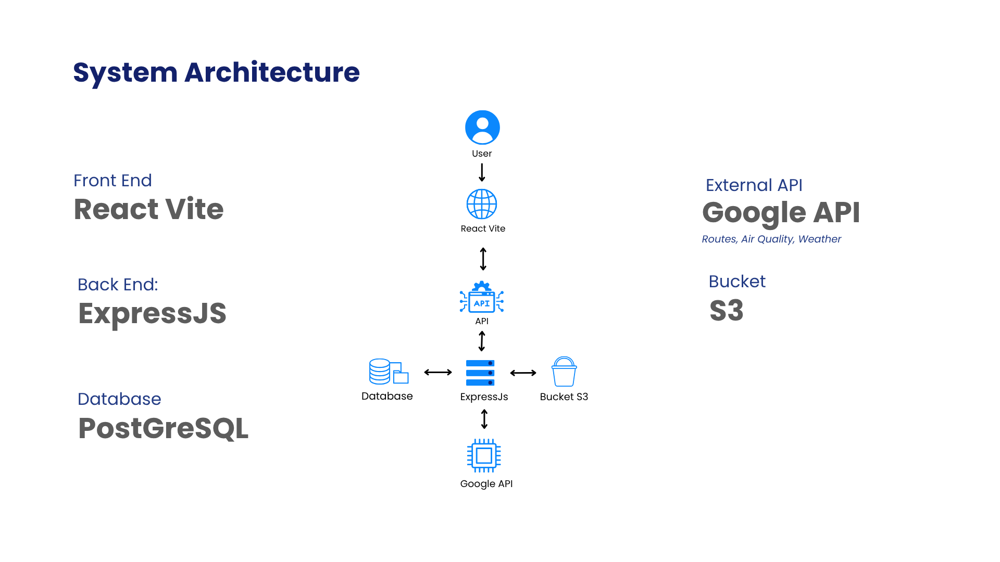
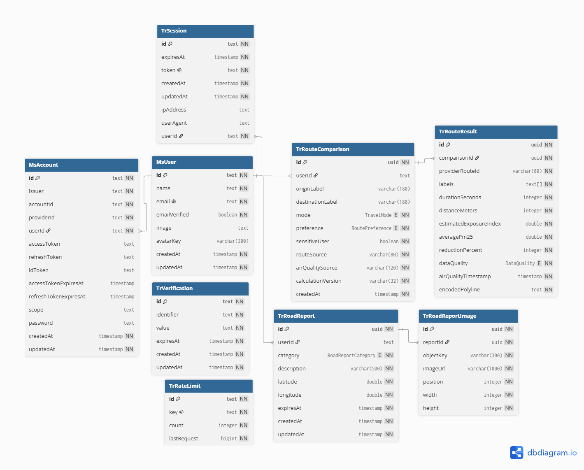

<div align="center">
  

  # AERoute
  ### A clearer route for every breath.

  [](https://github.com/AERoutee/AERoute-FE)
  [](https://github.com/AERoutee/AERoute-BE)
  [](https://github.com/AERoutee/AERoute-FE/blob/main/LICENSE)

  **Submission for ITECHNO CUP 2026 - Web Development**

  **By AERoute Team**
</div>

---

## 📋 Daftar Isi

- [Tentang Proyek](#-tentang-proyek)
- [Fitur Unggulan](#-fitur-unggulan)
- [Demo & Screenshot](#-demo--screenshot)
- [Teknologi](#-teknologi)
- [Arsitektur Sistem](#-arsitektur-sistem)
- [Instalasi & Setup](#-instalasi--setup)
- [Penggunaan](#-penggunaan)
- [API Documentation](#-api-documentation)
- [Testing](#-testing)
- [Tim Developer](#-tim-developer)
- [Lisensi](#-lisensi)

---

## 👥 Tim Developer

| Nama | Peran | GitHub |
| --- | --- | --- |
| **Andrian Pratama** | Project Lead & Lead Full-Stack Developer | [@Yanzz231](https://github.com/Yanzz231) |
| **Jeremy Auriel Zhang** | Full-Stack Developer | [@jeremzhg](https://github.com/jeremzhg) |
| **Calvin Wu** | Product Manager | [@5calvinw](https://github.com/5calvinw) |

---

## 🎯 Tentang Proyek

### Latar Belakang

Aplikasi navigasi umumnya mengoptimalkan waktu dan jarak. Bagi pejalan kaki dan pesepeda, keputusan perjalanan juga dipengaruhi kualitas udara, cuaca, aksesibilitas jalur, dan gangguan yang terjadi di lapangan. Informasi tersebut sering tersebar dan tidak terlihat dalam satu alur pengambilan keputusan.

AERoute mengangkat **SDG 11 — Kota dan Komunitas Berkelanjutan** melalui solusi mobilitas aktif yang membantu masyarakat memilih rute berjalan kaki dan bersepeda dengan konteks lingkungan serta kondisi komunitas.

### Solusi yang Ditawarkan

AERoute membandingkan alternatif rute berjalan kaki dan bersepeda menggunakan waktu tempuh, jarak, dan modeled PM2.5 exposure index. Setiap rute dapat menampilkan perubahan sample PM2.5 per segmen, weather checkpoints, live location, serta laporan komunitas dengan foto.

```text
estimated exposure index = average route PM2.5 × travel time in minutes
```

AERoute adalah produk informasional. Exposure index bukan personal dose, diagnosis, atau pengganti advis medis.

### Tujuan Proyek

- 🎯 **Tujuan Utama**: membantu pengguna memahami trade-off rute sebelum berjalan atau bersepeda.
- 📊 **Target Pengguna**: pejalan kaki, pesepeda, komuter perkotaan, dan pengguna yang lebih sensitif terhadap polusi.
- 💡 **Value Proposition**: menggabungkan route alternatives, PM2.5 context, weather context, live location, dan laporan komunitas pada satu map-first experience.

### Kesesuaian Aspek Penilaian

| Aspek Penyisihan | Bukti pada AERoute |
| --- | --- |
| **Kesesuaian Tema & Subtema — 20%** | Mendukung SDG 11 melalui route planning untuk mobilitas aktif, environmental context, dan community road reports |
| **Inovasi & Orisinalitas Ide — 20%** | Menggabungkan route alternatives, PM2.5 per segmen, weather checkpoints, live location, dan laporan komunitas |
| **Fungsionalitas Website — 20%** | Auth, OAuth, profile, recovery, route comparison, clickable polylines, reports, image upload, dan responsive panels terintegrasi end-to-end |
| **UI/UX & Responsivitas — 15%** | Public pages responsif, mobile bottom navigation, draggable desktop panels, bottom sheets, keyboard controls, dan semantic forms |
| **Implementasi Teknologi — 15%** | React/Vite SPA, Express modular API, Better Auth, Prisma/PostgreSQL, Google Maps Platform, private object storage, dan OpenAPI 3.1 |
| **Dokumentasi & Repositori — 10%** | README kompetisi, environment contract, architecture, setup, Swagger UI, dan semantic commit history |

---

## ✨ Fitur Unggulan

### Fitur Utama

| Fitur | Deskripsi | Keunggulan |
| --- | --- | --- |
| **PM2.5 Route Comparison** | Membandingkan alternatif rute berdasarkan waktu, jarak, dan exposure index | Trade-off lebih transparan daripada shortest-route only |
| **Segment-Level Air Context** | Mewarnai bagian rute berdasarkan sample PM2.5 lokal | Menunjukkan bahwa kondisi tidak selalu sama sepanjang rute |
| **Weather Along Route** | Menampilkan hourly forecast sesuai estimasi waktu pengguna mencapai titik rute | Prediksi cuaca terlihat langsung di map tanpa mencampur skor PM2.5 |
| **Community Road Reports** | Pengguna dapat melaporkan hazard, blocked path, crash, construction, atau map issue | Informasi lapangan tampil sebagai marker komunitas selama 24 jam |
| **Live Location** | Posisi dan heading diperbarui melalui browser geolocation | Mendukung pengalaman navigasi map-first |

### Fitur Tambahan

- **Route Priority** — Balanced dan Lower exposure.
- **Sensitive-user Mode** — memperluas toleransi waktu Balanced dari 20% menjadi 35%.
- **Clickable Route Lines** — garis route memiliki touch target besar dan dapat dipilih langsung.
- **Weather Checkpoints** — hourly forecast diambil pada 25%, 50%, dan 75% route berdasarkan ETA masing-masing titik.
- **Google OAuth** — login melalui Google atau email/password.
- **Secure Recovery** — opaque challenge ID dan OTP enam digit.
- **Profile Photo** — crop, resize, WebP processing, dan private storage.
- **Responsive Panels** — draggable desktop panels dan mobile bottom sheets.
- **Public Pages** — Landing, About, Vision & Mission, FAQ, Contact, dan responsive 404.

---

## 📸 Demo & Screenshot

### Live Demo

Live demo belum dipublikasikan.

Target deployment:

```text
Website : https://aeroute.my.id
API     : https://api.aeroute.my.id
Swagger : https://api.aeroute.my.id/api/docs
```

### Screenshot Aplikasi

Screenshot kompetisi belum ditambahkan. Screenshot landing, dashboard desktop, dashboard mobile, profile, dan report flow akan ditambahkan setelah deployment final.

### Video Demo

Video demo belum tersedia.

---

## 🛠️ Teknologi

### Tech Stack

#### Frontend

```text
Framework    : React 19 + Vite 8 + TypeScript
UI Library   : Tailwind CSS 4
Routing      : React Router
Server State : TanStack Query + Axios
Authentication: Better Auth React Client
Maps         : Google Maps JavaScript API + Places
Animation    : Motion
```

#### Backend

```text
Runtime      : Node.js + TypeScript ESM
Framework    : Express 5
Database     : PostgreSQL
ORM          : Prisma 7
Authentication: Better Auth
Validation   : Zod
Media        : Multer + Sharp + S3-compatible storage
Documentation: OpenAPI 3.1 + Swagger UI
```

#### DevOps & Tools

```text
Deployment   : Railway
Target Web   : aeroute.my.id
Target API   : api.aeroute.my.id
CI/CD        : Railway GitHub Integration (auto-deploy dari branch terhubung)
Testing      : Jest, React Testing Library, lint, TypeScript, build, Prisma validation
Monitoring   : LogRocket untuk frontend; Railway logs dan redacting request logger untuk backend
```

### Alasan Pemilihan Teknologi

| Teknologi | Alasan Pemilihan |
| --- | --- |
| **React + Vite** | Cocok untuk map overlays, responsive panels, route-level code splitting, dan development cepat |
| **Google Maps Platform** | Menyediakan map, place search, route geometry, air-quality, dan weather provider |
| **Express + Better Auth** | API modular dengan database session, OAuth, credential accounts, dan password management |
| **PostgreSQL + Prisma** | Data relasional, migration eksplisit, generated client, dan repository contract typed |
| **Sharp + S3 Storage** | Memproses avatar/report images tanpa membuat object storage publik |
| **Swagger UI** | Kontrak API dapat dibaca dan diuji secara interaktif oleh juri maupun frontend developer |

### Dependencies Utama

```json
{
  "frontend": {
    "react": "^19.2.8",
    "react-router": "^8.3.0",
    "@tanstack/react-query": "^5.102.2",
    "axios": "^1.19.0",
    "better-auth": "^1.7.1",
    "motion": "^13.1.1",
    "logrocket": "^12.3.0"
  },
  "backend": {
    "express": "^5.2.1",
    "better-auth": "^1.7.1",
    "@prisma/client": "^7.9.1",
    "zod": "^4.4.3",
    "sharp": "^0.35.3",
    "swagger-ui-express": "^5"
  }
}
```

---

## 🏗️ Arsitektur Sistem

### System Architecture



Frontend mengelola interaksi dan visualisasi. Backend menjadi sumber kebenaran untuk validation, ownership, provider orchestration, route ranking, PM2.5 sampling, recovery, report persistence, dan image processing.

### Database Schema



### Folder Structure

```text
AERoute/
├── AERoute-FE/
│   ├── public/
│   └── src/
│       ├── api/
│       ├── assets/
│       ├── components/
│       ├── config/
│       ├── context/
│       ├── hooks/
│       ├── pages/
│       └── types/
├── AERoute-BE/
│   ├── prisma/
│   └── src/
│       ├── config/
│       ├── middleware/
│       ├── modules/
│       └── utils/
├── docs/
├── .github/profile/
└── PRD.md
```

---

## ⚙️ Instalasi & Setup

### Prerequisites

Pastikan telah menginstall:

- Node.js 24 atau versi LTS modern yang didukung Vite 8.
- npm.
- PostgreSQL.
- Git.
- Google Cloud project dengan Maps JavaScript, Places, Routes, Air Quality, dan Weather API.
- SMTP account.
- S3-compatible private bucket.

### 1️⃣ Clone Repository

```bash
git clone https://github.com/AERoutee/AERoute-FE.git
git clone https://github.com/AERoutee/AERoute-BE.git
```

### 2️⃣ Setup Backend

```bash
cd AERoute-BE
npm ci
copy .env.example .env
npm run db:migrate
npm run dev
```

Backend berjalan di `http://localhost:3000`.

### 3️⃣ Setup Frontend

Buka terminal kedua:

```bash
cd AERoute-FE
npm ci
copy .env.example .env
npm run dev
```

Frontend berjalan di `http://localhost:5173`.

### 4️⃣ Environment Variables

Frontend:

```env
VITE_API_BASE_URL="http://localhost:3000"
VITE_GOOGLE_MAPS_BROWSER_KEY="replace-with-browser-restricted-key"
VITE_LOGROCKET_APP_ID="your-workspace/your-app"
VITE_APP_VERSION="0.1.0"
```

Backend groups:

```text
Application : NODE_ENV, PORT, FRONTEND_ORIGIN, CORS_ORIGINS, TRUST_PROXY
Auth        : BETTER_AUTH_URL, BETTER_AUTH_SECRET, GOOGLE_CLIENT_ID, GOOGLE_CLIENT_SECRET
Database    : DATABASE_URL
Providers   : GOOGLE_MAPS_SERVER_KEY, PROVIDER_TIMEOUT_MS
Email       : SMTP_HOST, SMTP_PORT, SMTP_SECURE, SMTP_USER, SMTP_PASSWORD
Storage     : S3_ENDPOINT, S3_REGION, S3_BUCKET, S3_PUBLIC_BASE_URL, S3_ACCESS_KEY_ID, S3_SECRET_ACCESS_KEY
```

Jangan commit `.env`. Server secrets tidak boleh memakai prefix `VITE_`.

### Railway Deployment & CI/CD

Kedua repository memiliki `railway.json`:

- Railway Railpack menjalankan `npm ci --include=dev` dan production build.
- Backend menjalankan `npm run db:migrate` sebagai pre-deploy command.
- Backend health check memakai `/api/health`; frontend memakai `/`.
- Railway GitHub Integration menjadi CI/CD deployment: push ke branch terhubung memicu build, health check, dan deploy otomatis.
- Variable production dikonfigurasi melalui Railway Variables, bukan file `.env` di repository.

### Monitoring

LogRocket hanya diinisialisasi pada production ketika `VITE_LOGROCKET_APP_ID` tersedia. Konfigurasi AERoute menonaktifkan IP capture serta menyensor text, inputs, images, query strings, request/response body, dan headers. Backend dipantau melalui Railway logs dan request logger yang meredaksi credential, OTP, cookie, token, dan file buffer.

---

## 🚀 Penggunaan

### Menjalankan Aplikasi

Frontend:

```bash
npm run dev
npm run lint
npm run typecheck
npm run build
npm run preview
```

Backend:

```bash
npm run dev
npm run lint
npm run typecheck
npm run build
npm start
npm run db:migrate
npm run db:studio
```

### User Guide

#### Untuk Pengguna Umum

1. Buka landing page AERoute.
2. Pilih **Sign in** atau **Create account**.
3. Buka dashboard map.
4. Izinkan browser location jika ingin live marker dan road report.
5. Pilih origin dan destination.
6. Pilih Walk/Cycle serta Balanced/Lower exposure.
7. Aktifkan Sensitive-user mode bila ingin toleransi waktu Balanced lebih konservatif.
8. Tekan **Compare routes**.
9. Klik route card atau langsung klik garis route pada map.
10. Aktifkan Weather/Community Reports melalui Layers bila diperlukan.

#### Mengirim Community Report

1. Tekan **Report** pada dashboard.
2. Pilih kategori masalah.
3. Lokasi report diambil ketika report flow dimulai.
4. Isi deskripsi 10–500 karakter.
5. Tambahkan maksimal tiga foto JPG/PNG/WebP, maksimal 3 MB per gambar.
6. Klik thumbnail untuk full-screen preview sebelum submit.
7. Submit report. Report aktif selama 24 jam dan dapat dilihat pengguna lain pada viewport terkait.

#### Mengelola Akun

1. Buka menu profile.
2. Ubah nama atau profile photo.
3. Akun Google dapat menambahkan password setelah verifikasi OTP.
4. Forgot-password membuat opaque challenge ID dan mengirim OTP enam digit.
5. Password reset mencabut session lama.

#### Admin

AERoute MVP belum memiliki admin panel. Moderation/admin workflow belum termasuk scope aktif.

---

## 📚 API Documentation

### Base URL

```text
Development : http://localhost:3000
Production  : https://api.aeroute.my.id
Swagger UI : https://api.aeroute.my.id/api/docs
OpenAPI JSON: https://api.aeroute.my.id/api/openapi.json
```

Local Swagger:

```text
http://localhost:3000/api/docs
http://localhost:3000/api/openapi.json
```

### Health

```http
GET /api/health
```

### Authentication

```http
POST /api/auth/sign-up/email
POST /api/auth/sign-in/email
POST /api/auth/sign-in/social
GET  /api/auth/get-session
POST /api/auth/sign-out
POST /api/auth/update-user
POST /api/auth/change-password
GET  /api/auth/list-accounts
```

### Password Recovery

```http
POST /api/v1/recovery-challenges
GET  /api/v1/recovery-challenges/:id
POST /api/v1/recovery-challenges/:id/resend
POST /api/v1/recovery-challenges/:id/verify
POST /api/v1/recovery-challenges/:id/reset
```

### Profile Image

```http
GET    /api/v1/profile/avatar/:userId
PUT    /api/v1/profile/avatar
DELETE /api/v1/profile/avatar
```

### Route Comparison

```http
POST /api/v1/route-comparisons
```

### Community Road Reports

```http
GET  /api/v1/road-reports
POST /api/v1/road-reports
GET  /api/v1/road-report-images/:id
```

Dokumentasi request body, response schema, multipart upload, cookie security, contoh, dan status code tersedia lengkap di Swagger UI.

---

## 🧪 Testing

Jest digunakan untuk pure business logic dan behavior-focused component tests. Test provider eksternal tetap dilakukan melalui integration/manual QA agar tidak menghasilkan test palsu.

### Running Tests

```bash
# Frontend atau backend
npm test
npm run test:watch
npm run test:coverage
```

### Quality Checks

```bash
# Frontend
npm run lint
npm run typecheck
npm run build

# Backend
npm run lint
npm run typecheck
npm run build
npx prisma validate
```

### Integration QA

- Google Maps rendering dan Places autocomplete.
- Walking/cycling provider coverage.
- PM2.5 dan weather sampling.
- Browser geolocation dan heading update.
- Camera/gallery upload dan image preview.
- Better Auth email/password dan Google OAuth.
- SMTP connection serta OTP delivery.
- Private object-storage read/write/delete.
- Swagger UI dan OpenAPI JSON.

### Coverage

Coverage dapat dibuat melalui `npm run test:coverage`. Minimum global threshold yang dikonfigurasi: 80% lines/functions/statements dan 70% branches untuk file yang masuk coverage scope.

Hasil terakhir pada coverage scope:

```text
Frontend : 98.23% statements, 85.29% branches, 100% functions, 100% lines
Backend  : 99.45% statements, 96.85% branches, 98.57% functions, 100% lines
```

Angka tersebut hanya mewakili pure logic/components yang masuk `collectCoverageFrom`, bukan keseluruhan Google Maps/provider integration.

---

## 📄 Lisensi

Proyek ini dilisensikan di bawah [MIT License](https://github.com/AERoutee/AERoute-FE/blob/main/LICENSE).

---

<div align="center">

  **Made with ❤️ by AERoute Team for ITECHNO CUP 2026**

</div>
